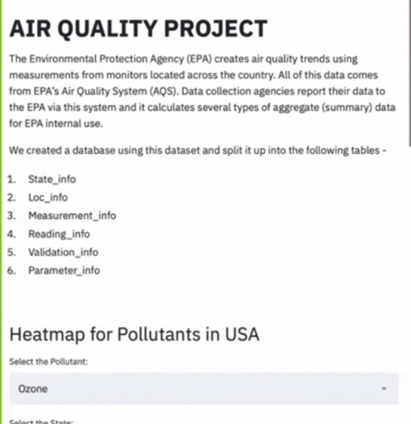
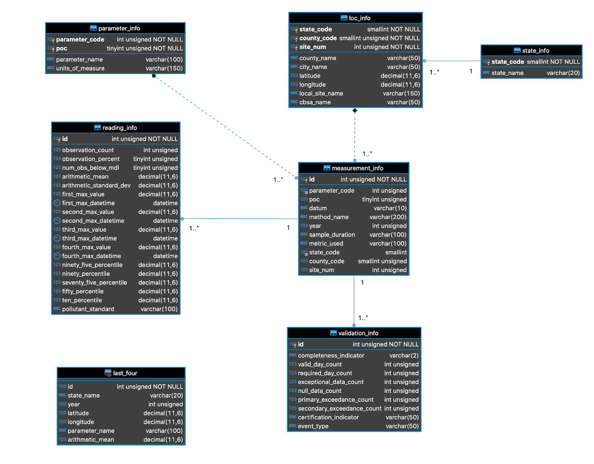

# Air Quality Project
## DS 5420-01 Data Management Systems - Spring 2020
### Vanderbilt University

Contributers:

[Ali Yaqoob](https://www.linkedin.com/in/aliyaqoob/)

[Shaswat Rajput](https://www.linkedin.com/in/shaswat-rajput/)

#### Demo
This is a short demo of the project.

#### Description
This project aims to develop an application using a database created from the air quality trends dataset collected and curated by the Environmental Protection Agency (EPA). The Environmental Protection Agency collects data from various sites/monitors and creates air quality trends. This data comes from the EPA’s Air Quality System. The agencies responsible for collecting this data report their data to EPA via their system, and it calculates different types of measurement summaries. 

#### Application
This application can be used by individuals who wish to view and add to the data already curated by the EPA. This application allows its users to visualize the trends in the measurements taken and allows its users to visualize, through a heatmap, the trends in measurements of pollutants over the course of multiple years. It also supports the functionality to add or delete from the data in case a user wants to make some changes or add to the already present readings. It currently supports the visualization of pollutants most representative of air quality (Ozone, Sulphur Dioxide, Carbon Dioxide, Carbon Monoxide and Nitrogen Dioxide). However, the database used to create this application is much more comprehensive as it consists of all EPA air quality data since the year 1980. 

We chose to build this application as it seemed to be something that could not only be extended into something more substantial, but was also something that could be very useful to visualize and observe the trends of over multiple years. 

#### Dataset
The dataset consists of 55 columns and is 900MB in size. One of the main reasons this dataset was chosen was because it satisfied the dataset requirements and was an interesting one to visualize and build an application out of. The columns can be split into five types of information. This categorization helped us determine how to create tables for the database that we created for this application. 

The categories:
- Information about where the measurement was taken
- Information about how the measurement was taken
- Information about what was being measured
- Information that added to information about the measurement. 

#### Implementation 
The final application was built using a database created from the dataset given in Kaggle, with the help of a Python based frontend which used an open-source framework called Streamlit. 

#### UML
This is the UML that was used to create the database used in this project. 

